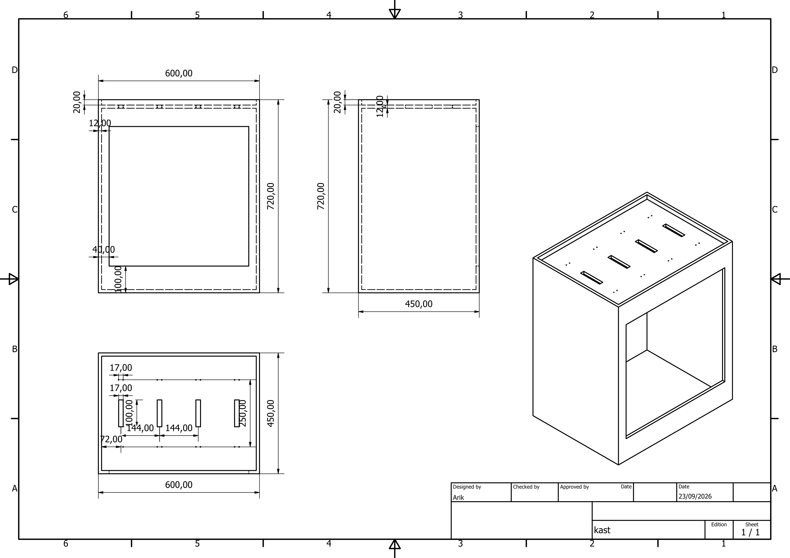
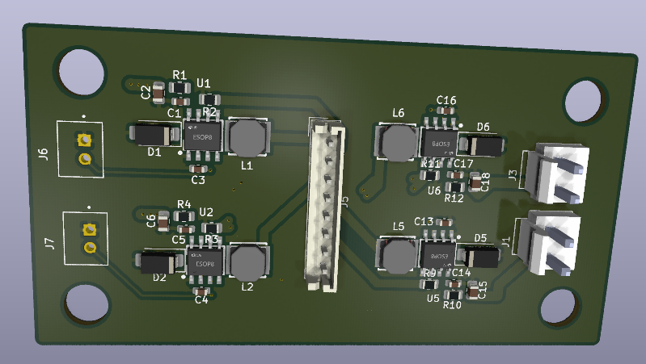
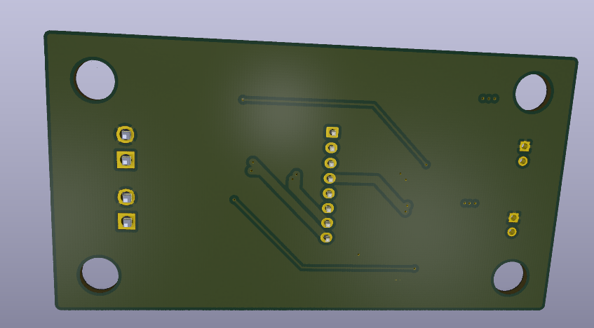
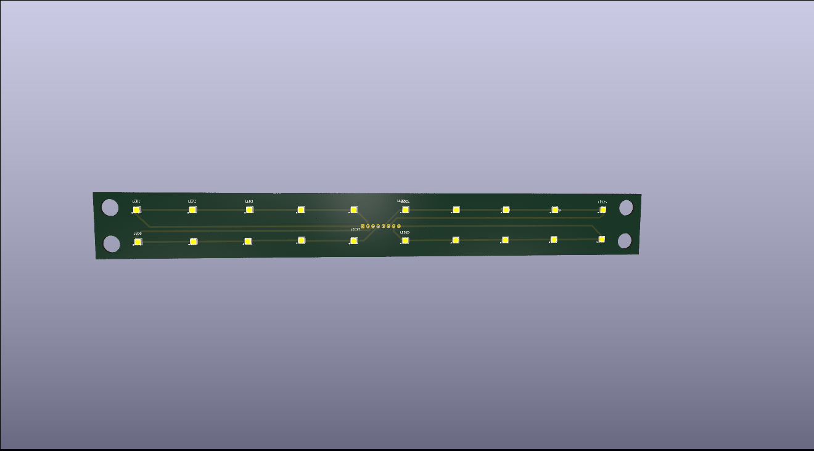
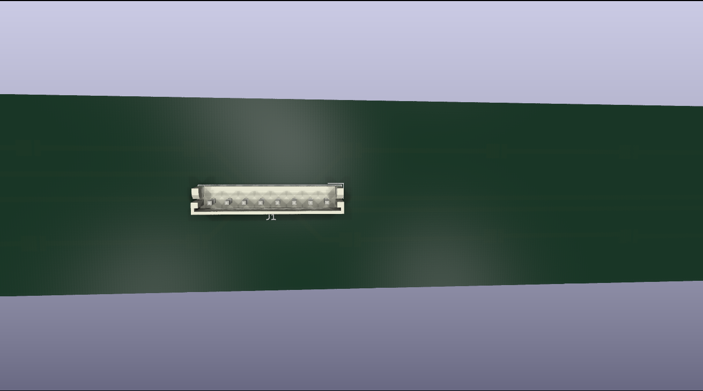
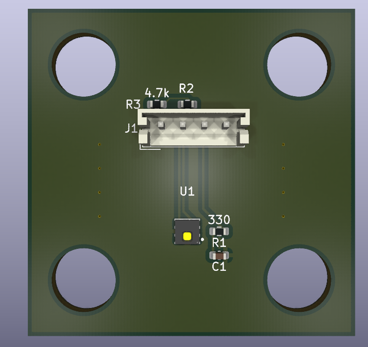

<p align="center">
  
</p>

<h1 align="center">🌱 GrowBox</h1>

<p align="center">
  Open-source USB-C powered smart microgrowery<br/>
  ESP32-S3 hub · 87W LED panel · WiFi dashboard · Camera streaming · USB-C PD
</p>

<p align="center">
  
  
  
  
</p>

---

## Table of Contents

- [Overview](#overview)
- [Cabinet](#cabinet)
- [PCB Boards](#pcb-boards)
- [Web Dashboard](#web-dashboard)
- [Camera Feed](#camera-feed)
- [Features](#features)
- [Grow Schedule Recommendations](#grow-schedule-recommendations)
- [Build & Technical Reference](BUILD.md)
- [Bill of Materials](BOM.md)
- [License](#license)

---

## Overview

GrowBox is a fully custom USB-C powered microgrowery designed to fit under a desk. The controller drives an 87W warm white LED grow panel, controls intake and exhaust ventilation fans, monitors temperature and humidity, streams a live camera feed, and serves a local web dashboard — all from a single USB-C cable.

Everything is custom designed: four separate PCBs, ESP32-S3 firmware in bare C using ESP-IDF, and a self-contained HTML dashboard served directly from the microcontroller.

<p align="center">
  
</p>

**Key specs at a glance:**

| Parameter | Value |
|-----------|-------|
| Input power | USB-C PD 20V via FUSB302 |
| Max LED power | 87W (80× warm white LEDs) |
| LED panel | 4× boards in a grid |
| Cabinet size | 600 × 450 × 720mm (external) |
| MCU | ESP32-S3 bare SoC, 8MB NOR flash |
| Connectivity | WiFi 802.11 b/g/n, mDNS `growbox.local` |
| Environment sensor | AHT20 temperature + humidity |
| Camera | ESP32-CAM MJPEG stream |
| Fan control | 2× PWM fans, independent speed |

---

## Cabinet

Constructed from 12mm MDF, interior walls painted white for light distribution. A DIY activated carbon filter with a 120mm exhaust fan handles odor control.

<p align="center">
  
  &nbsp;&nbsp;
  
</p>

<p align="center">
  
  &nbsp;&nbsp;
  
</p>

```
External:   600 × 450 × 720mm  (W × D × H)
Internal:   576 × 426 × 696mm  (external minus 2× 12mm MDF wall per axis)
Fan intake:  120mm, bottom-right panel
Fan exhaust: 120mm, top-right panel
Carbon filter: 3D printed housing, 80mm activated carbon bed, inline on exhaust
```

<p align="center">
  
</p>

---

## PCB Boards

Four custom PCBs, designed in KiCad and manufactured at JLCPCB. Full GPIO pinout, connector tables and component values live in [BUILD.md](BUILD.md).

### 1. Main Hub Board

The brain of the system — ESP32-S3, FUSB302 PD sink negotiation, AP63203 3.3V regulator, 8MB flash, and JST connectors for every other board and peripheral.

<p align="center">
  
  &nbsp;&nbsp;
  
</p>

<p align="center">
  
  &nbsp;&nbsp;
  
</p>

### 2. LED Driver Board

One of four identical boards — 4× TX6120 constant-current drivers each, powering 4 strings of 5 LEDs (~21.8W per board, ~87W across all four).

<p align="center">
  
  &nbsp;&nbsp;
  
</p>

<p align="center">
  
  &nbsp;&nbsp;
  
</p>

<p align="center">
  
</p>

### 3. LED Panel Board

One of four identical boards — 20× XL-3030WWC-1W-3V warm white LEDs each (80 total), single-layer FR4 with an aluminum bottom layer for heat spreading.

<p align="center">
  
  &nbsp;&nbsp;
  
</p>

<p align="center">
  
  &nbsp;&nbsp;
  
</p>

<p align="center">
  
</p>

### 4. Sensor Board

A minimal standalone board carrying just the AHT20 temperature/humidity sensor, connected to the hub over a 4-pin I2C cable. Mounted mid-height on the cabinet wall, away from heat sources, for accurate ambient readings.

<p align="center">
  
  &nbsp;&nbsp;
  
</p>

---

## Web Dashboard

A single self-contained HTML file served directly from ESP32-S3 flash — no internet connection required. Access it at `http://growbox.local` from any device on the same WiFi network.

<p align="center">
  
</p>
<p align="center">
  
</p>

<p align="center">
  
  &nbsp;&nbsp;
  
  &nbsp;&nbsp;
  
</p>

| Panel | Description |
|-------|-------------|
| Camera feed | Live MJPEG stream from ESP32-CAM, tap to enable/disable |
| Temperature / humidity | Live readings, session min/max |
| LED brightness | Slider 0–100% with live watt estimation |
| Fan control | Independent intake and exhaust sliders |
| Light schedule | On/off time pickers, 24h visual timeline, enable toggle |
| System status | WiFi RSSI, uptime, PD status, free heap, grow day counter |
| Power summary | Estimated total wall draw |

---

## Camera Feed

The ESP32-CAM mounts on the interior cabinet wall via a 3D printed bracket, angled downward to cover the full plant canopy, connected to the hub over a 4-wire UART cable. It streams on demand only — power-saving start/stop commands are sent as the dashboard opens and closes the feed. Protocol details in [BUILD.md](BUILD.md).

<p align="center">
  
</p>

<p align="center">
  
</p>

---

## Features

- **USB-C PD negotiation** — full FUSB302 driver written from scratch in C. Requests 20V fixed PDO, handles Source_Capabilities, Accept, PS_RDY. Retries every 30 seconds on failure, renegotiates on cable disconnect
- **LED brightness control** — 0–100% PWM via LEDC at 25kHz. Smooth 5-minute sunrise/sunset ramp on schedule transitions. Persisted to NVS
- **Light schedule** — configurable on/off time, SNTP sync, Europe/Brussels timezone, grow day counter from first boot
- **Fan control** — independent intake and exhaust speed 0–100%
- **Environment monitoring** — AHT20 polled every 10 seconds, session min/max for temperature and humidity
- **Camera integration** — ESP32-CAM sends IP over UART on boot, hub proxies MJPEG to browser on demand
- **Web dashboard** — self-contained single HTML file, mobile responsive, no internet dependency
- **WiFi provisioning** — SoftAP captive portal on first boot, saves credentials to NVS, connects automatically after
- **mDNS** — accessible at `growbox.local`, no IP address needed

---

## Grow Schedule Recommendations

| Crop | Light on | Light off | Hours | Brightness |
|------|---------|----------|-------|-----------|
| Seedlings (all) | 06:00 | 22:00 | 16h | 40% |
| Vegetative cannabis | 06:00 | 00:00 | 18h | 70% |
| Autoflower full cycle | 06:00 | 00:00 | 18h | 75% |
| Photoperiod flowering | 08:00 | 20:00 | 12h | 85% |
| Peppers / chili | 06:00 | 22:00 | 16h | 65% |
| Herbs / lettuce | 06:00 | 22:00 | 16h | 55% |
| Microgreens | 06:00 | 22:00 | 16h | 45% |

Power draw at each brightness level: see [BUILD.md](BUILD.md#power-budget).

---

## More

- **[BUILD.md](BUILD.md)** — GPIO pinout, wiring, connectors, NVS config, task structure, project layout, and build/flash instructions
- **[BOM.md](BOM.md)** — parts list and cost breakdown

---

## License

MIT License — see [LICENSE](LICENSE) file.

---

<p align="center">
  Made by Arik · IoT & Electronics Engineering Student · Belgium
</p>

<p align="center">
  
</p>
