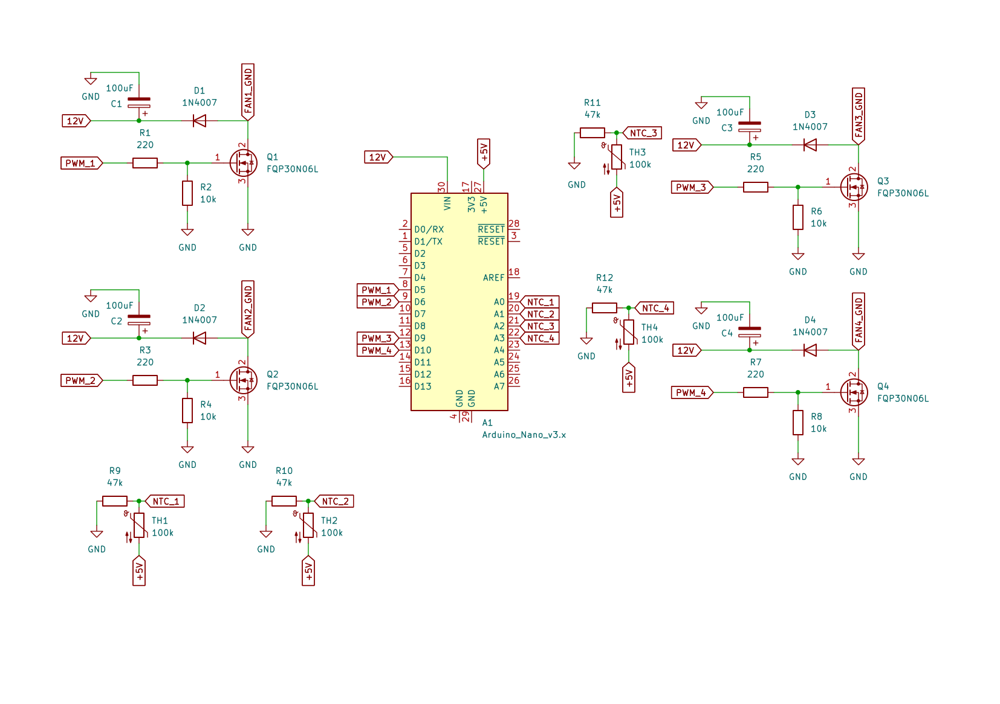

# GrowBox Fan Controller

Arduino Nano sketch, independent of the ESP32-S3 hub and ESP32-CAM — see
[../BUILD.md#thermal-analysis--led-board-cooling](../BUILD.md#thermal-analysis--led-board-cooling)
for why the LED heatsinks need active cooling in the first place, and
[../README.md](../README.md) for the cabinet-level overview.

## What it does

4 independent zones, one per LED board. Each zone has its own NTC
thermistor — mounted directly on that board's PCB, not on a heatsink, so
it reads that specific board's temperature rather than general cabinet
airflow — and its own MOSFET switching that board's 2 fans together. A
board running hotter than the other 3 only speeds up its own 2 fans, not
all 8; each board's cooling is independent of the others.

Runs standalone on purpose: fan cooling keeps working even if the hub
reboots, the camera hangs, or WiFi is down — none of that affects this
board, which shares no pins or power with either.

## Fan curve (tune these against a real thermocouple)

| Board temp | That board's 2 fans |
|---|---|
| < 35°C | off |
| 35°C – 55°C | ramps 35%–100% |
| ≥ 55°C | full speed |
| that zone's sensor open/shorted | that zone fails to full speed; other 3 zones unaffected |

Thresholds are `#define`s at the top of `fan_controller.ino` — the
35°C/55°C numbers are starting points, not measured values; see the
thermal analysis in BUILD.md for why (no datasheet thermal-resistance
data exists for these exact parts, so nothing in that chain is lab
measured yet).

## Noise

Each 5015 blower is rated ~24-28dB. Sound pressure from N identical
incoherent sources adds `10*log10(N)` dB, so all 8 fans (4 boards × 2
each) at full speed simultaneously is roughly a 9dB bump over one fan
alone — about **33-37dB combined**, treating all 8 as equidistant (a
rough worst-case estimate, not a measurement). Because the 4 boards share
the same dashboard brightness setting, they'll usually run close to the
same temperature and ramp up together in practice, even though each
zone's speed is computed independently — the "independent zones" design
is mainly about catching the board that's hotter than the others (worse
airflow, a bad thermal pad, etc.), not about normal operation being wildly
uneven. At low brightness all 4 zones stay off or quiet.

## Wiring (×4, one set per zone)

<p align="center">
  
</p>

```
+5V ---[TH: 100k NTC]---+---[R: 47k]--- GND      (NTC on the LED board's own PCB)
                        |
                        Nano Ax

Nano PWM pin ----------- MOSFET gate (direct — FQP30N06L is logic-level, no series resistor)
                         gate --[10k pulldown to GND]
MOSFET source -> GND
MOSFET drain  -> FANn_GND (that board's 2 fans' common return)
12V ---[220R]--+-- 1N4007 (cathode) -- FANn_GND     (snubber/flyback, clamps the
               |                                     switching spike back toward
             [100uF to GND]                          the rail instead of across the MOSFET)
Fans' + -> 12V rail (same one already on the main hub board)
```

| Zone (board) | NTC pin | MOSFET gate pin | Snubber R / D / C | Gate pulldown |
|---|---|---|---|---|
| 1 | A0 (NTC_1) | D5 (PWM_1) | R1 220Ω / D1 1N4007 / C1 100µF | R2 10k |
| 2 | A1 (NTC_2) | D6 (PWM_2) | R3 220Ω / D2 1N4007 / C2 100µF | R4 10k |
| 3 | A2 (NTC_3) | D9 (PWM_3) | R5 220Ω / D3 1N4007 / C3 100µF | R6 10k |
| 4 | A3 (NTC_4) | D10 (PWM_4) | R7 220Ω / D4 1N4007 / C4 100µF | R8 10k |

NTC divider resistors: R9 (zone 1), R10 (zone 2), R11 (zone 3), R12
(zone 4), all 47kΩ. MOSFETs: Q1–Q4, FQP30N06L (TO-220, logic-level gate —
safe to drive straight from the Nano's 5V PWM output, which is why there's
no gate series resistor in this design).

Keep this board-to-pin mapping consistent with how the boards are
physically labeled in the cabinet — otherwise "board 3 running hot" on
the serial log points at the wrong board.

The gate pull-down on each MOSFET matters: without it, that gate floats
during Nano power-on/reset (before `setup()` runs) and can sit in a lossy
partially-on state that heats up the MOSFET itself — not just a lost few
hundred ms of cooling. The 220Ω/1N4007/100µF network per channel clamps
the inductive switching spike from the fan motor back toward the 12V rail
(through the resistor, which limits clamp current) instead of letting it
ring across the MOSFET's drain-source junction, and the 100µF cap locally
decouples that channel's share of the 12V rail.

NTC part: HNTC-104F3950FB, 100kΩ @25°C, B=3950, ±1% ([LCSC C52204613](https://lcsc.com/product-detail/C52204613.html)),
paired with a 47kΩ series resistor — update `SERIES_RESISTOR_OHMS` in the
sketch if the real build ends up using a different series value. If you
ever swap to a different NTC part, double-check its Beta rating before
reusing these defaults; a wrong Beta/R25 shifts the whole curve without
giving any obvious sign that it's wrong.

## Flashing

Stock Arduino IDE, board "Arduino Nano", no external libraries. Open
`fan_controller.ino` and upload — same as any Nano sketch.

## Known gaps

- Thresholds are unverified placeholders — needs real thermocouple
  validation on each board, same caveat as the rest of the thermal
  analysis this design is based on.
- No tachometer feedback (fans' 3rd wire, if present, isn't read) — the
  controller can't detect a stalled or disconnected fan on a given zone,
  only react to that zone's temperature.
- An NTC mounted on the PCB (rather than on the heatsink itself) reads
  board temperature, which tracks junction temperature more directly but
  lags heatsink temperature slightly — fine for this fan curve's purpose,
  worth knowing if you ever compare readings against the heatsink-surface
  numbers in the BUILD.md thermal analysis.

Schematic source: [docs/Schematics/fan_controller.pdf](../docs/Schematics/fan_controller.pdf).
